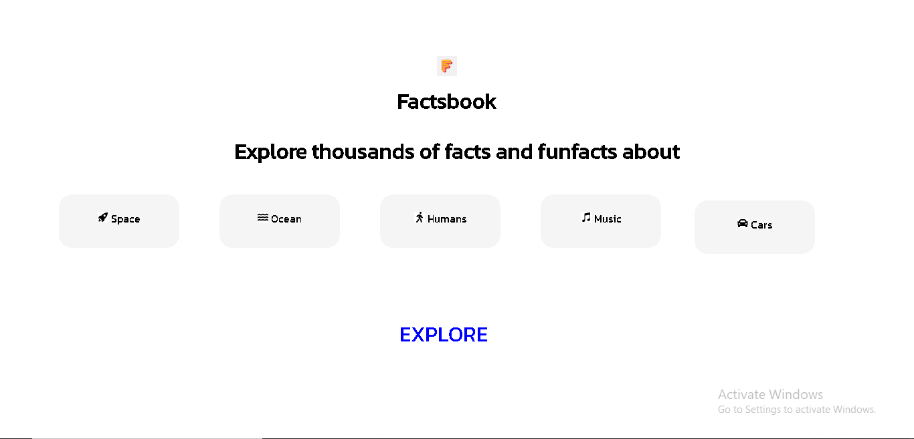
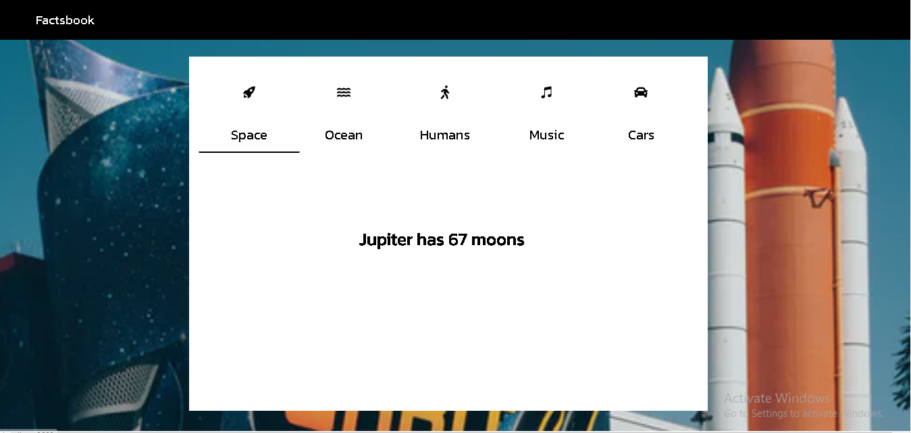
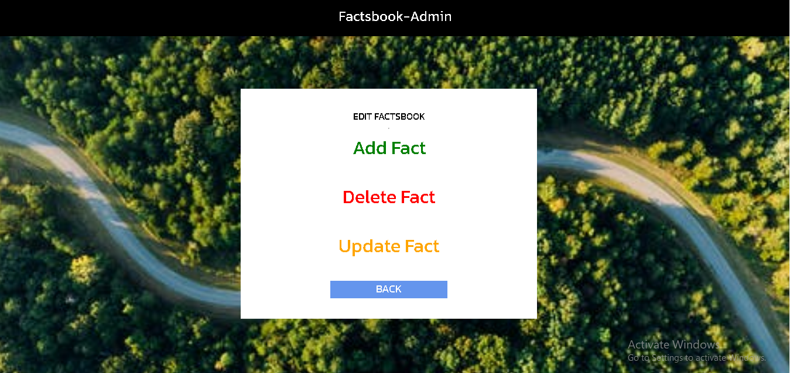
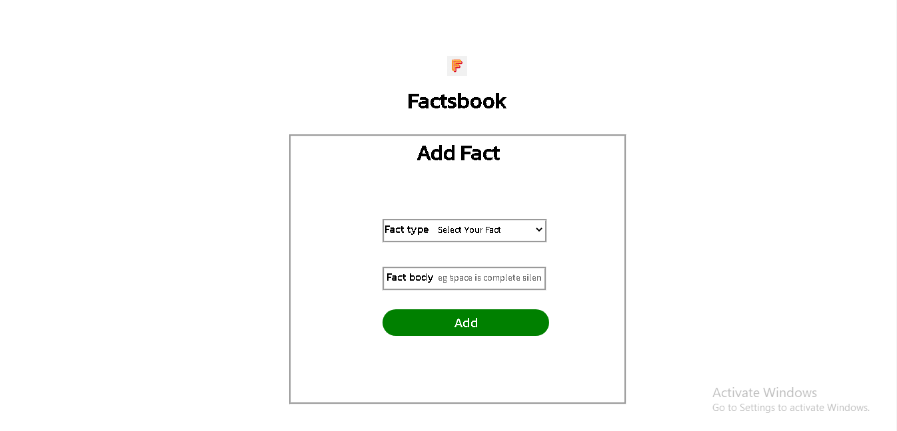
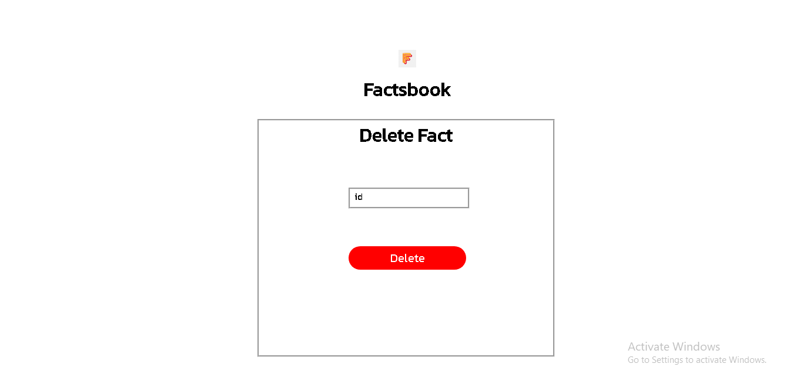
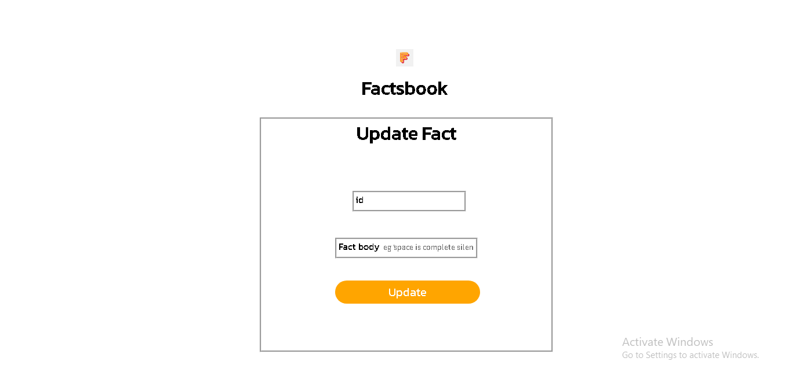

***About factsbook -***
*Factsbook allows you to explore thousands of facts/funfacts collected from internet at a
single place. You can explore facts/funfacts about areas of your interests like: Space, Ocean,
Music, Humans and Cars.*

***Technical Details -***
*Factsbook has multiple react components created using HTML, CSS and Javascript.
Data is fetched using REST APIs from Flask and Python. Data is stored in MongoDB
collections.*

#Frontend Technologies - 
HTML
CSS
React
Javascript

#Backend Technologies -
Python
Flask APIs

#Database and Tools -
MongoDB
MongoDB Compass
Postman

#IDE and Code -
Visual Studio Code
Git, Github

*In this website first page can be landing page , landing page have logo of website and one heading with 5 different categories of facts,
 and one explore button . When user click on explore button user redirect in factsbook website , factsbook website have one navbar with left hand side they have 
 website name , one card that have 5 catergories that can be Space,ocean,humans,music,cars . By default space can be selected , when user click another fact ,
 that can be ocean , humans,music ,cars, User get one fact about that fact also background image change relavent that fact, black line move to that fact 
 bellow.*

Factsbook landing page

Factsbook home page

Factsbook admin page

Factsbook add fact page

Factsbook delete fact page

Factsbook update fact page

